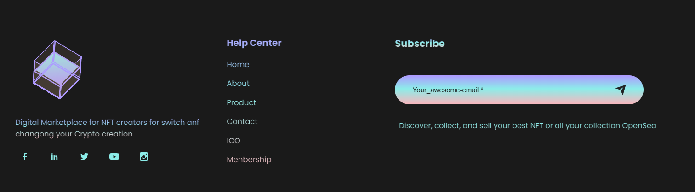

# **NFT-API** 🪙

This project is an API for managing non-fungible tokens (NFTs). It provides a set of endpoints to interact with NFTs, including creating, updating, and querying NFT metadata.


#

## 🚀 **Getting Started**

To get started with the NFT-API, follow these steps:

1. _Clone the repository_:

git clone https://github.com/Neocor89/nft-api.git

2. _Install the dependencies_:

```bash
cd nft-api
npm install
```

AND

```bash
cd web3
npm install
```

3. _Configure the environment variables_:

Create a `.env` file in the root directory and specify the following environment variables:

```bash
DATABASE=DATABASE_STRING
DATABASE_PASSWORD=YOUR_PASSWORD
PORT=3000
DATABASE_URL=mongodb://localhost:27017/nft-api

JWT_SECRET=nft-api-jwt-secret-key-theblockchaincoders-project
JWT_EXPIRES_IN=50d
JWT_COOKIE_EXPIRES_IN=50
```

⚠️ Adjust the values according to your setup.

<div style="margin-top: 10px;"></div>

4. _Start the server_:

The API will be accessible at `http://localhost:3000`

---

<div style="margin-top: 20px;"></div>

## **API Endpoints**

The following API endpoints are available:

- `POST /nfts`: Create a new NFT.
- `GET /nfts`: Get a list of all NFTs.
- `GET /nfts/:id`: Get details of a specific NFT by ID.
- `PUT /nfts/:id`: Update details of a specific NFT by ID.
- `DELETE /nfts/:id`: Delete a specific NFT by ID.

For detailed information on how to use each endpoint, refer to the API documentation.

---

<div style="margin-top: 20px;"></div>

## **Technologies Used**

<!-- ADDING GIT BADGES -->

The **`NFT-API`** project is built using the following technologies:

- Node.js: A JavaScript runtime for executing server-side code.
- Express.js: A web application framework for Node.js.
- MongoDB: A NoSQL database for storing NFT metadata.
- Mongoose: An Object Data Modeling (ODM) library for MongoDB.
- dotenv: A module for loading environment variables from a `.env` file.

---

<div style="margin-top: 20px;"></div>

## **Contributing**

Contributions to the NFT-API project are welcome! If you find any bugs or have suggestions for improvements, please create an issue or submit a pull request.

Before contributing, please read the [CONTRIBUTING.md](CONTRIBUTING.md) file for guidelines.

## **License**

This project is licensed under the [MIT License](LICENSE).

#

Feel free to modify and customize this README file according to your specific needs.

<div style="margin-top: 30px;"></div>

### **PROVISIONAL RENDER**

---

`FOOTER OF PROJECT "NFT SHARING"`


